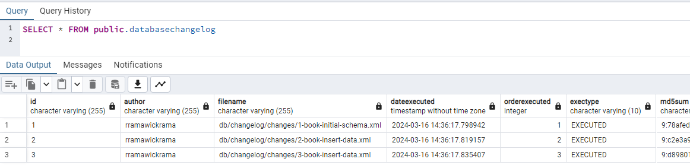

# Evolving Database Schema with Liquibase and Spring Boot

This project highlights how to evolve a database schema with **Liquibase** and Spring Boot.

### What is Liquibase?

Liquibase is an open-source database schema change management tool. It allows developers to manage and version database schema changes in a systematic and controlled manner. Liquibase provides a way to define database changes using a declarative approach, typically using XML, YAML, JSON, or SQL formats.

Refer https://docs.liquibase.com/home.html for more details.

### Prerequisites
Before running the application, make sure the following list is installed/configured on your machine:

* Java version 17 or above
* Maven
* PostgreSQL
* pgAdmin
* Postman (Optional)

### Running the Application

1. Clone the project using the command `git clone https://github.com/ruviniramawickrama/demo-liquibase-with-spring-boot.git`
2. Go to the cloned project's root directory and open a command prompt
3. Build the project using the command `mvn clean install`
4. Run the project using the command `mvn spring-boot:run`
5. Use the Postman collection `DemoLiquibaseWithSpringBoot.postman_collection.json` to invoke the REST end points (`\src\main\resources\DemoLiquibaseWithSpringBoot.postman_collection.json`)

### Application Details

`pom.xml`
- Contains the dependencies related to Liquibase, Postgres (database connection) and Spring Data JPA.

`application.yml`
- Contains the properties related to Liquibase and Postgres.

`db.changelog-master.xml`
- Main entry point for Liquibase to understand and execute database changes defined in multiple changelog files.
- In this example, we have included the directory path for all sub changelog files in the master changelog. However, we also have the option to compose changelogs directly within the master file or specify distinct file paths for different changelog files.
- As shown in the below snapshot, once we build the application, a separate table named **databasechangelog** is created in the respective database schema, which contains entries for all the changelog files executed on the respective schema.  

`1-book-initial-schema.xml`
- Sub changelog file which contains the sql script to create Book table. 
- Other than using raw SQL to create a table, Liquibase also supports various other formats such as XML, YAML, and JSON to achieve the same.
- Refer https://docs.liquibase.com/change-types/create-table.html for more details.

`3-book-insert-data.xml` and  `2-book-insert-data.xml`
- Sub changelog files to insert data into the Book table.
- Other than using raw SQL to insert data, Liquibase also supports various other formats such as XML, YAML, and JSON to achieve the same.
- Refer https://docs.liquibase.com/change-types/insert.html for more details.

`BookController.java`
- REST Controller which contains the `getBooks` REST end point to retrieve all the books created in the database.

`BookService.java` 
- Implemented by `BookServiceImpl.java` which is responsible for communicating with the repository class to retrieve Books.

`BookRepository.java` 
- Implements Spring Data JpaRepository which provides ready-made methods to communicate with the database. It uses `Book.java` as the entity which maps with the respective database table.
